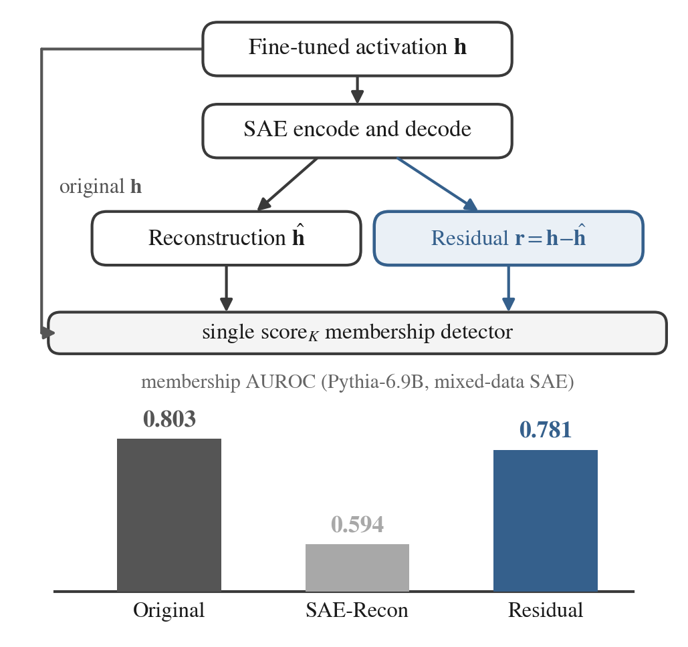

# The Dark Subspace of Fine-Tuning Memorisation

[](https://openreview.net/forum?id=5wI8OkQJxi)
[](https://github.com/NiloyPurkait/DarkSubspace/actions/workflows/verify.yml)
[](LICENSE)
[](pyproject.toml)

Code and results artefact for **The Dark Subspace of Fine-Tuning Memorisation** ([paper](https://openreview.net/forum?id=5wI8OkQJxi)), accepted as a Spotlight at the ICML 2026 Workshop on Mechanistic Interpretability (Seoul, 2026).

<p align="center">
  
</p>

A sparse autoencoder trained on fine-tuned activations discards membership-identifying signal during reconstruction, yet that signal stays linearly recoverable from the reconstruction residual. We call the residual subspace that carries it the dark subspace. This repository contains the paper-specific experiment code, a curated set of JSON results, the camera-ready figures under `assets/figures/`, and a CPU-only verifier that checks the paper-cited numerical claims against the included JSON records. The manuscript is distributed separately and is not in this repository.

## Quickstart

The verifier uses only the Python standard library and reads the JSON files under `results/dark_subspace/`.

```bash
python3 scripts/dark_subspace/verify_claims.py
```

Expected output (final summary line).

```text
Asserted check summary: 255/255 pass, 0 fail
All asserted checks pass within tolerance.
```

A `Makefile` wraps the common entry points (`make verify`, `make headline`, `make test`, `make figures`). Data and checkpoint provisioning is documented in `DATA.md`, and the submission-to-camera-ready delta is in `CHANGELOG.md`.

For full experiment scripts, install the package dependencies first, then run any script with `--help` to inspect its CLI.

```bash
python3 -m venv .venv
.venv/bin/python -m pip install --upgrade pip
.venv/bin/python -m pip install -e .

# After install, the experiment scripts accept --help for CLI documentation.
.venv/bin/python scripts/dark_subspace/behavioral_channels.py --help
.venv/bin/python scripts/dark_subspace/sae_dark_subspace.py --help
.venv/bin/python scripts/dark_subspace/subspace_ablation_eval.py --help
```

## Compute requirements

- Verifier (recommended first check). CPU only, no GPU, no network, no model loading. Completes in a few seconds. Reads only JSON files under `results/dark_subspace/`.
- Full reproduction. GPU cluster. Per-job wallclocks range from 30 minutes to 36 hours on H100 or any A40 or L40S class node, depending on model size and SAE token budget. The Pythia-6.9B and Pythia-12B multi-seed SAE training jobs dominate the budget. Per-script SLURM wrappers under `scripts/dark_subspace/shell/` document the exact `--time`, `--gres`, and partition.
- Disk. Bundled JSONs total a few MB. SAE checkpoints, fine-tuned model weights, and the controlled corpus regenerate to a separate `runs/` tree (see `.gitignore`) and total tens of GB across the bundled experiments.

## Pre-Registration

`PROTOCOL_DISCLOSURE.md` documents the pre-registered methodological items (PR-1 to PR-8), the SAE validity gates, the K-PC ablation decisive criteria, the bag-of-words confound control, the paraphrase sensitivity diagnostic, and the statistical reporting protocol. It also records a single post-hoc audit, the held-out partition-fit falsification audit on $d_K$, which is documented as post-hoc rather than pre-registered.

## Repository Layout

| Path | Contents |
| --- | --- |
| `results/dark_subspace/` | JSON records consumed by the verifier and referenced from the claim map. |
| `scripts/dark_subspace/` | Paper-specific experiment, aggregation, plotting, and verification scripts. |
| `scripts/dark_subspace/shell/` | SLURM wrappers for GPU jobs and multi-seed arrays. |
| `scripts/shared/` | Shared SAE training, plotting style, path bootstrap, and utility code. |
| `src/sae_mia_audit/` | Reusable Python package used by the paper scripts. |
| `assets/figures/` | Camera-ready figures in PDF and PNG, regenerable from the JSON tree and the hero-figure generator. |
| `tests/` | Artefact-integrity tests, including a no-internal-path-leak check. |
| `DATA.md`, `Makefile`, `CHANGELOG.md` | Data and checkpoint provisioning, convenience targets, and the release history. |

Large inputs, generated checkpoints, and manuscript source are not included in the repository. Full reproduction expects the controlled fine-tuning corpora, model checkpoints, and SAE checkpoints at the paths documented in the relevant scripts.

## Verification

`scripts/dark_subspace/verify_claims.py` is the recommended first check. It validates the main paper numbers using only the JSON records under `results/dark_subspace/`.

- Channel-decomposition geometry and layer-sweep values.
- Main reconstruction-and-residual AUROC rows.
- Pythia-6.9B N=5 mixed-data SAE cohort (harmonised across the multi-seed runs).
- Pythia-12B five-seed mixed-data SAE replication.
- Norm-baseline and scaling-table values.
- Standard MIA probe results.

The verifier does not load models, require GPUs, submit SLURM jobs, access the network, or write files.

## Naming notes

The Claim-Source Map below uses paper terminology throughout. A small number of engineering labels survive in JSON path strings and a few script filenames. The table below maps each one back to the paper passage.

| Label in path or filename | Paper passage |
| --- | --- |
| `behavioral_channels.py`, paths under `behavioral_channels/` | Channel decomposition, paper §3.2 ("Separating the knowledge channel from the recall channel") and Appendix §`app:bcd_details`. The paper-cited values bind to the per-model analysis layer fixed in advance in Appendix Table `tab:model_details` (selected before any SAE training by maximising cross-validated logistic membership AUROC on raw residual-stream activations, see Methods §3.1). The `best_membership_layer` and `best_membership_auroc` fields in `summary.json` are run-time diagnostics over the `--layers` sweep, not the paper-cited headline. |
| `errPC` in paths under `causal_ablation/p12b_errPC_K{5,10}/` | K-PC residual ablation, Appendix Table `tab:kpc_kten_cells`. The label names the engineering implementation (top-K right-singular vectors of the SAE reconstruction residual). The paper prose calls it "K-PC". |
| `per_row_bootstrap_kocl2.py` filename | Per-row paired bootstrap for the directional sign-test cohort, Appendix §`app:koc2_bootstrap`. The script filename uses `kocl2` as an engineering label. The paper appendix label is `koc2`. |
| `memcirc` in paths under `data/memcirc_ctrl_ft/`, `runs/sae/memcirc_*`, `bow_ceiling/memcirc_ctrl_ft/` | Earlier project label retained only in path strings for provenance. Current code paths use `dark_subspace/`. |
| `_postfix` in seed labels (notably `42_postfix` in the Pythia-6.9B mixed cohort) | The Pythia-6.9B seed-42 SAE was retrained once after the initial run to correct an SAE-checkpoint inconsistency identified during the validity-gate sweep. The `_postfix` suffix is retained on disk for provenance. The original seed-42 SAE is no longer used by any paper-cited number. The cohort label `42_postfix` is canonically labelled `42` in `tab:dark_subspace` and the harmonised JSON's `seed_label` field. |
| `_v2` in `behavioral_channels/{falcon7b,mistral,llama3}_epoch5_v2/`, `figure_data_loader.py`, `verify_claims.py` | Second-pass run of the channel-decomposition pipeline on the larger non-Pythia SAEs. The `_v1` cohort is not used by any paper-cited number. `_v2` is the canonical run. The suffix is retained on disk for provenance. |
| `_secondary` in `cohort_bootstrap.json` (`qwen2_mult4_secondary_seeds`) | Two additional Qwen2 mult=4 fine-tuning seeds (43 and 44) reported separately from the directional-sign-test cohort. They examine whether the inversion is specific to the original fine-tuning seed. They are not entered into the cohort sign-test denominator (which keeps n=5). The full per-row CIs for these two seeds appear in `tab:koc2_bootstrap_per_row` ("Qwen2-7B mult=4 across additional fine-tuning seeds" subsection). |
| `dd_table_render.py`, runtime paths under `generated/double_dissociation/` and `generated/double_dissociation_epochs/` | Extraction-detection separation tables `tab:dd_full`, `tab:dd_extraction`, `tab:epoch_dd` (paper §3.5 and §4.4). The earlier "double dissociation" label is retained as engineering shorthand in the renderer filename and runtime output paths. |

## Claim-Source Map

The table below maps each paper passage to the script and JSON source that reproduce the corresponding result. `results/dark_subspace/generated/` mirrors the relevant JSON files from the run tree, so review does not require the full `runs/` directory.

Rows are grouped into **main claims** (the headline argument, channel decomposition, the residual-above-reconstruction ordering and its replications, the alternative-explanation tests, the feature-intervention dissociation, and the extraction-detection separation finding) and **supporting claims and controls** (robustness, confound, and scope tests).

### Main claims

| Paper passage | What to verify | Source script | JSON source |
| --- | --- | --- | --- |
| Methods §3.2 ("Separating the knowledge channel from the recall channel"), Results §4.1, Appendix Table `tab:bcd_main` | Channel-decomposition geometry, recall-direction separation, stability across SAE seeds | `scripts/dark_subspace/behavioral_channels.py`, `scripts/dark_subspace/sae_noise_floor_aggregate.py` | `results/dark_subspace/generated/behavioral_channels/*/orthogonality.json`, `results/dark_subspace/generated/sae_noise_floor/p69_aggregate.json` |
| Results §4.2 ("SAE reconstruction fails to preserve membership signal recoverable from the residual"), Table `tab:dark_subspace` | Pythia-6.9B N=5 mixed-data SAE reconstruction reduction | `scripts/dark_subspace/p69_n5_harmonize.py` | `results/dark_subspace/paper_claims/p69_n5_harmonized_2026-05-06.json`. Five SAEs (seeds 42, 43, 44, 45, 46) at identical hyperparameters (layer 16, multiplier 4, L1 5e-4, 200M tokens, dead-feature resampling). The seed list matches the Pythia-1B multi-seed cohort. The N=6 aggregate is also bundled at `paper_claims/p69_n6_complete.json`. Per-metric mean shifts between N=5 and N=6 are below 0.005 on all reported metrics. |
| Results §4.2, Table `tab:dark_subspace` (Pythia-6.9B member-only N=5 row) | Pythia-6.9B N=5 member-only SAE reconstruction reduction | Aggregated from per-seed `runs/dark_subspace/sae_dark_subspace/p69_member_only_sae_seed{42..46}/results.json` (per-seed runs not bundled, regenerate from `scripts/shared/train_sae.py` + `scripts/dark_subspace/sae_dark_subspace.py`) | `results/dark_subspace/paper_claims/p69_member_only_n5.json`. Five SAEs trained on member-only documents at the same hyperparameters as the mixed cohort. The `cluster_summary_n5` block carries the per-seed mean, min, and max for the table cell values. |
| Appendix `app:p12b_replication`, Table `tab:dark_subspace` | Pythia-12B mixed-data SAE multi-seed replication, full five-seed cohort (47, 48, 49, 50, 51) | `scripts/dark_subspace/p12b_multiseed_query.py`, `scripts/dark_subspace/shell/sbatch_p12b_multiseed_array.sh` (covers seeds 47 to 51 via `--array=0-4`) | `results/dark_subspace/generated/sae_dark_subspace/p12b_mixed_sae_seed{47,48,49,50,51}/results.json`. All five per-seed `results.json` files are bundled. The underlying SAE checkpoints are not bundled and regenerate from the array script on rerun. |
| Appendix `app:koc2_bootstrap` ("Paired Bootstrap for the Directional Sign-Test Settings"), Table `tab:koc2_bootstrap_per_row` (Margin column) | Per-row paired-bootstrap CIs and the Margin column, defined as Residual minus Reconstruction. All nine per-row margins are positive, one-sided $p \approx 2^{-9} \approx 0.002$ | `scripts/dark_subspace/per_row_bootstrap_kocl2_residual_minus_recon.py` | `results/dark_subspace/paper_claims/k_oc2_bootstrap_residual_minus_reconstruction_2026-05-05.json`. The `cohort_rows` and `qwen2_mult4_secondary_seeds` arrays carry the nine per-row Residual-minus-Reconstruction margins, and `across_all_9_rows.n_margin_positive` records 9 of 9 positive. |
| Appendix `app:koc2_bootstrap` cohort directional sign test | Cohort-level sign test on the five inverting rows, with the Margin defined as Residual minus Original. One-sided binomial $p \approx 2^{-5} \approx 0.03125$ | `scripts/dark_subspace/per_row_bootstrap_kocl2.py` | `results/dark_subspace/paper_claims/cohort_bootstrap.json`. Its `margin_observed` is Residual minus Original, a different contrast from the per-row Margin column above, so two of its seven rows are negative. The `sign_test` block records `n_inverting_cohort_rows=5` and the cohort one-sided binomial $p \approx 0.03125$. This is distinct from the body sign test on `tab:dark_subspace` (n=7, next row). |
| Results §4.2 (paragraph beginning "Every validity-gate-passing setting shows residual above SAE-Recon...") and Appendix `app:koc2_bootstrap` paragraph "Binomial sign-test arithmetic" | Body binomial sign test on the seven gate-passing rows of `tab:dark_subspace` (no $\dagger$ or $\ddagger$). Full set p$\approx$0.008, non-Pythia subset (n=4) p$\approx$0.0625 | `scripts/dark_subspace/verify_claims.py` (asserted-check section "Body sign test on `tab:dark_subspace` gate-passing rows") | `results/dark_subspace/paper_claims/tab_dark_subspace_sign_test.json`. The body sign test uses the seven `tab:dark_subspace` gate-passing rows as its denominator. The cohort sign test (previous row) uses the five inverting cohort rows. The two denominators overlap but are not identical. The JSON's `relationship_to_cohort_bootstrap` field documents the difference. |
| Appendix Table `tab:fsc_values` (feature-sufficiency criterion, an alternative-explanation test) | FSC against $S_K$ for classifier features and full dictionary, with random-subset null and feature-ablation controls | `scripts/dark_subspace/fsc_random_null.py`, `scripts/dark_subspace/feature_ablation_dark_subspace.py`, `scripts/dark_subspace/feature_ablation_random_k.py`, `scripts/dark_subspace/behavioral_channels.py` | `results/dark_subspace/paper_claims/fsc_values.json` (bundled, all 8 model rows of `tab:fsc_values` mirroring the canonical `behavioral_channels.py` `sae_alignment.json` output for each model). The verifier asserts that disk and paper agree to within 0.0015 on $\mathrm{FSC}(\SK, \mathrm{CF})$ and exactly on $n_{\mathrm{CF}}$, $\mathrm{FSC}(\SK, \mathrm{all})$, $\mathrm{FSC}(\SR, \mathrm{all})$. Per-model `behavioral_channels/*/sae_alignment.json` outputs regenerate on rerun and are not bundled because they carry SAE checkpoint references. The feature-ablation per-cell records are at `results/dark_subspace/generated/sae_dark_subspace/p69_feature_ablation/results.json` and the per-model classifier-feature extractability predictors at `results/dark_subspace/generated/bcd_extractability/<model_tag>/extractability_predictor.json`. |
| Methods §3.5 / Results §4.4 (`tab:dd_full`, `tab:dd_extraction`, `tab:epoch_dd`, `app:per_model_dd`) extraction-detection separation under subspace erasure | Membership AUROC, mean member loss, exact-match rate, and extraction ROUGE-L under $S_K$/$S_R$ erasure (Methods Eq. 3) | `scripts/dark_subspace/dd_table_render.py` renders the table from per-cell records produced by the GPU pipeline (model load, basis fit, forward-pass erasure hook, decoded continuations, ROUGE-L scoring). See the script docstring for the per-cell record schema. | `results/dark_subspace/paper_claims/extraction_detection_separation.json`. Encodes the manuscript-rendered cell values for `tab:dd_full` (4 model rows × 2 metrics × 4 conditions), `tab:dd_extraction` (8 model rows × 4 conditions, ROUGE-L), and `tab:epoch_dd` (3 epochs × 2 metrics × 4 conditions). The per-cell GPU-pipeline records carry SAE checkpoint references and decoded-text arrays and are not bundled. |
| Methods §3.5 ("Interventions separate extraction from detection"), Results §4.5, Appendix Table `tab:kpc_kten_cells` | K-PC residual ablation at K=10 and K=5 (with random-rotation, matched-Gaussian, and column-mask controls) | `scripts/dark_subspace/subspace_ablation_eval.py` | `results/dark_subspace/generated/causal_ablation/p12b_errPC_K10/results.json`, `results/dark_subspace/generated/causal_ablation_K5/p12b_errPC_K5/results.json` (paths use `errPC` as the engineering label for K-PC, see "Naming notes" above) |
| Figure `fig:privacy_aware`, Appendix Table `tab:fresh_probe_v2` (privacy-aware $d_K$-penalised SAE comparison) | Privacy-aware SAE comparison ($d_K$-penalised SAE versus standard SAE) | `scripts/dark_subspace/finetune_sae_dk.py`, `scripts/dark_subspace/fresh_probe_test.py` | `results/dark_subspace/generated/sae_dark_subspace/p69_ft_dk{0.1,1.0}/results.json` |

### Supporting claims and controls

| Paper passage | What to verify | Source script | JSON source |
| --- | --- | --- | --- |
| Results §4.5, Appendix Table `tab:norm_direction` | Norm-direction baseline | `scripts/dark_subspace/norm_baseline.py` | `results/dark_subspace/generated/norm_baseline/*/results.json` |
| Appendix `tab:heldout_dk_per_split`, `app:heldout_dk_protocol` ("Held-Out Estimation Preserves Ordering but Reduces Magnitude") | Held-out partition-fit reductions for $d_K$ on Pythia-6.9B and Pythia-12B | `scripts/dark_subspace/heldout_dk_eval.py` | `results/dark_subspace/paper_claims/heldout_dk.json` |
| Appendix `tab:l2_normalized` ("L2-normalised residual membership AUROC") | Norm-versus-direction split of residual signal | `scripts/dark_subspace/l2_normalized_auroc.py` plus `scripts/dark_subspace/norm_baseline.py` | The activation-norm half of the table is reproducible from the bundled `norm_baseline/*/results.json`. The L2-normalised residual AUROC half regenerates to `results/dark_subspace/generated/l2_normalized/<model_tag>/results.json` on rerun against the matching SAE-residual scores, and is not bundled. |
| Appendix `tab:epoch_dd` ("Extraction-Detection Separation Across Fine-Tuning Epochs") | Pythia-1B extraction-detection separation across fine-tuning epochs | `scripts/dark_subspace/dd_table_render.py --table epoch_dd` | Regenerates to `results/dark_subspace/generated/double_dissociation_epochs/<model_tag>/results.json` on rerun. Per-epoch records are not bundled. |
| Appendix `tab:dynamics`, `app:training_dynamics` ("Recall channel emerges before knowledge channel during fine-tuning") | Pythia-1B epoch and pretraining-checkpoint dynamics | `scripts/dark_subspace/behavioral_channels.py` (per-checkpoint SLURM in `scripts/dark_subspace/shell/multiseed/sbatch_p1b.sh`) | `results/dark_subspace/generated/behavioral_channels/{p1b_epoch1,p1b_epoch3,p1b_epoch5}/orthogonality.json` |
| Appendix per-layer tables `tab:p1b_layers`, `tab:p69_layers`, `tab:p12b_layers`, `tab:neo_layers`, `tab:opt_layers`, `tab:falcon_layers`, `tab:mistral_layers`, `tab:llama3_layers`, `tab:qwen2_layers` | Full per-layer channel decomposition (cosine similarity, principal angle, membership AUROC, recall AUROC) per model | `scripts/dark_subspace/behavioral_channels.py` | `results/dark_subspace/generated/behavioral_channels/<model_tag>/orthogonality.json` (the `per_layer` block carries one entry per layer in the diagnostic sweep). |
| Appendix `tab:scaling`, `app:scaling` ("Scaling Curve") | Pythia-70M to Pythia-12B $\mathrm{score}_K$ scaling sweep | `scripts/dark_subspace/behavioral_channels.py` (per-model SLURM wrappers under `scripts/dark_subspace/shell/multiseed/`) | `results/dark_subspace/generated/behavioral_channels/{p70m_epoch5,p160m_epoch5,p410m_epoch5,p1b_epoch5,p2.8b_epoch5,p69_epoch5,p12b_epoch5}/orthogonality.json` |
| Results §4.1, Appendix `app:per_layer` | Pre-fine-tuning baseline and fine-tuned layer sweep | `scripts/dark_subspace/behavioral_channels.py` (driver `scripts/dark_subspace/shell/sbatch_pre_ft_baseline.sh`) | `results/dark_subspace/generated/behavioral_channels/{p69_BASE_pre_ft,p69_epoch5_layer_sweep}/orthogonality.json` |
| Methods §3.7 ("Validity gate for quantitative claims"), Appendix bootstrap and control tables | Bootstrap replicate count (n_boot=10000) | `scripts/dark_subspace/subspace_ablation_eval.py`, `scripts/dark_subspace/per_row_bootstrap_kocl2.py`, `scripts/dark_subspace/rerun_bootstrap_cis.py` | Script arguments and bootstrap JSON metadata |
| Results §4.6 ("Confound and operating-point controls do not reverse the finding"), Appendix `app:bow_baseline` | Bag-of-words ceiling | `scripts/dark_subspace/bow_ceiling.py` | `results/dark_subspace/generated/bow_ceiling/memcirc_ctrl_ft/results.json` |
| Results §4.6, Appendix `app:tpr_paraphrase` | Word-order paraphrase orientation flip and paraphrase TPR at 1% and 5% FPR | `scripts/dark_subspace/paraphrase_sensitivity.py` | `results/dark_subspace/generated/paraphrase_sensitivity/{p69,qwen2,p12b}/results.json` |
| Appendix `tab:tpr_at_0p1pct_fpr`, `app:tpr_paraphrase` | TPR at 0.1% FPR for residual $d_K$ across four models | `scripts/dark_subspace/tpr_at_low_fpr.py` (consumes per-text score arrays from the matching `sae_dark_subspace.py` outputs) | `results/dark_subspace/generated/tpr_low_fpr/{p69,p12b,neo,qwen2}/results.json` (bundled). Each file records `tpr_point`, `tpr_boot_mean`, `tpr_ci_lo`, `tpr_ci_hi` from $n_{\mathrm{boot}}=10000$ bootstrap with seed 12345, plus `fpr_target=0.001` and `n_member=n_nonmember=1000`. The per-text score arrays themselves are not bundled and regenerate from `sae_dark_subspace.py` on rerun. |
| Results §4.6, Appendix `app:standard_probes` | Standard published MIA probes (loss attack, MIN-K%, zlib) under reconstruction/residual decomposition | `scripts/dark_subspace/standard_mia_probe_decomposition.py` | `results/dark_subspace/generated/standard_mia_probes/p69_dark_subspace_replication/results.json` |
| Appendix `app:topk_scope` ("TopK SAEs Do Not Reproduce the Residual Ordering"), reviewer scope test | TopK SAE scope test on Pythia-6.9B layer 16 multiplier 4, with $K \in \{32, 64, 128\}$ at five seeds each (15 settings). Residual exceeds reconstruction in 0 of 15, mean reconstruction cosine 0.983, mean reduction about 0.037 versus about 0.21 for the L1 SAE | `scripts/dark_subspace/aggregate_topk_scope.py` (aggregator), `scripts/dark_subspace/shell/sbatch_topk_p69_scope_array.sh` (trains the 15 TopK SAEs via `scripts/shared/train_sae.py --topk`), `sbatch_topk_p69_scope_eval_array.sh` (per-cell decomposition) | `results/dark_subspace/generated/topk_scope/cluster_summary.json`. The `cross_K_summary` block records `n_total=15`, `recon_cosine_mean=0.983`, `delta_recon_mean=0.037`, `sign_test_residual_gt_recon="0/15"`, and `cosine_ge_0p90_pass="15/15"`. |
| Appendix `app:frikha_features` ("Feature Selection Does Not Reach the Residual Membership Signal"), reviewer scope test | PrivacyScalpel-style feature-selection audit on Pythia-6.9B under the L1 SAE. A logistic detector on the full SAE code reaches AUROC 0.526. Across 60 feature-selection settings (three criteria by four depths by five seeds) the residual membership detector moves by at most 0.0218, while verbatim extraction drops by about 0.19 | `scripts/dark_subspace/frikha_baseline_ablation.py` (per-seed grid), `scripts/dark_subspace/frikha_n5_aggregate.py` (aggregator), `scripts/dark_subspace/shell/sbatch_frikha_baseline_p69.sh` and `sbatch_frikha_baseline_p69_array.sh` | `results/dark_subspace/generated/frikha_features/cluster_summary.json`. `cluster_summary.baseline_no_ablation.latent_probe_auroc_5fold.mean` records 0.526 and `cluster_summary.directional_pattern_check.residual_auroc_max_deviation_from_baseline` records 0.0218. |
| Appendix `tab:nonlinear` ("Non-Linear Probing Comparison") | MLP-vs-linear probe AUROC at the analysis layer | `scripts/dark_subspace/nonlinear_probe.py` (consumes mean-pooled activations from `extract_canonical_activations.py`) | Regenerates to `results/dark_subspace/generated/nonlinear_probe/<model_tag>/results.json` on rerun. Not bundled. |
| Appendix `app:length_baseline` ("Length-Feature Baseline") | Length-feature membership classifier on the controlled split | `scripts/dark_subspace/length_baseline.py` (consumes the member and non-member text JSONLs, CPU-only) | Regenerates to `results/dark_subspace/generated/length_baseline/<model_tag>/results.json` on rerun. Not bundled. |
| Appendix `app:label_shuffled_null` ("Label-Shuffled Permutation Test") | Permutation null on $\cos(d_K, d_R)$ under shuffled member/non-member labels | `scripts/dark_subspace/label_shuffled_null.py` (consumes mean-pooled activations and the saved $d_R$ from the channel-decomposition output) | Regenerates to `results/dark_subspace/generated/label_shuffled_null/<model_tag>/results.json` on rerun. Not bundled. |
| Appendix `app:corpus_disjoint` ("Corpus-Disjoint Dictionary Control") | Pythia-6.9B mixed-data SAE retrained on an OWT partition disjoint from the evaluation pool | `scripts/dark_subspace/build_disjoint_owt_corpus.py` (corpus prep) plus `scripts/dark_subspace/sae_dark_subspace.py` (driver `scripts/dark_subspace/shell/sbatch_p69_disjoint_owt_sae.sh`) | Regenerates to `runs/dark_subspace/sae_dark_subspace/p69_disjoint_owt_seed${SEED}/results.json` on rerun. Not bundled. |
| Appendix `app:additional_controls` random-direction baseline | 100 random unit-direction membership AUROC per model | `scripts/dark_subspace/random_direction_baseline.py` (driver `scripts/dark_subspace/shell/sbatch_random_direction_baseline.sh`) | Regenerates to `results/dark_subspace/generated/random_direction/<model_tag>/results.json` on rerun. Not bundled. |
| Appendix `app:additional_controls` random-init SAE | Replacing the trained SAE with a randomly initialised SAE on Pythia-6.9B layer 16 | `scripts/dark_subspace/make_random_sae.py` plus `scripts/dark_subspace/sae_dark_subspace.py` (driver `scripts/dark_subspace/shell/sbatch_random_init_sae.sh`) | Regenerates to `results/dark_subspace/generated/sae_dark_subspace/p69_random_init_sae/results.json` on rerun. Not bundled. |
| Appendix `app:additional_controls` pre-fine-tuning control | Channel decomposition on the un-fine-tuned base Pythia-6.9B | `scripts/dark_subspace/behavioral_channels.py` (driver `scripts/dark_subspace/shell/sbatch_pre_ft_baseline.sh`) | `results/dark_subspace/generated/behavioral_channels/p69_BASE_pre_ft/orthogonality.json` |

### Configuration-audit tables

Two paper tables summarise hyperparameter and SAE-quality settings rather than experimental results. The underlying training runs are produced by `scripts/shared/train_sae.py` via the SLURM wrappers under `scripts/dark_subspace/shell/`. The tables themselves are hand-assembled audits of those settings.

| Paper passage | Source |
| --- | --- |
| `tab:per_model_hps` (per-model SAE hyperparameter audit) | Compiled from the per-model `scripts/dark_subspace/shell/multiseed/sbatch_*.sh` wrappers, which record the model checkpoint, layer, dictionary multiplier, L1 coefficient, and training-token budget actually used. |
| `tab:sae_gate_audit` (Qwen2 mixed-data SAE audit, Appendix `app:qwen2_pilot`) | Compiled from the Qwen2 SAE training runs documented in `scripts/dark_subspace/shell/multiseed/sbatch_qwen2_mult8.sh`. |

### Figures

The camera-ready figures are shipped under `assets/figures/` in PDF and PNG. Every data figure also regenerates from the JSON tree under `results/dark_subspace/` via the plotting scripts under `scripts/dark_subspace/`, and the hero concept figure regenerates from its own generator.

| Figure(s) | Producing script |
| --- | --- |
| `fig:residual_audit` (hero concept figure) | `scripts/dark_subspace/make_residual_audit_overview.py` (writes to `assets/figures/`) |
| `fig:score_distributions`, `fig:score_distributions_full` | `scripts/dark_subspace/plot_score_distributions.py` (writes both the body 1x3 simple variant and the appendix 2x3 full variant) |
| `fig:privacy_aware` | `scripts/dark_subspace/plot_privacy_aware_comparison.py` |
| `fig:layer_trajectories`, `fig:arch_and_scaling`, `fig:dark_subspace_heatmap`, `fig:fsc`, `fig:epoch`, `fig:norm_direction`, `fig:layer_heatmap`, `fig:sae_quality_scatter` | `scripts/dark_subspace/plot_figures.py`, `scripts/dark_subspace/plot_advanced_figures.py` |

## Full Reproduction

The GPU pipeline is split by experiment class rather than collapsed into one monolithic driver. This makes individual controls and reruns auditable without coupling unrelated jobs.

Useful entry points after `pip install -e .`.

```bash
# Recompute the channel decomposition for a configured model.
python3 scripts/dark_subspace/behavioral_channels.py --help

# Run the SAE reconstruction/residual decomposition.
python3 scripts/dark_subspace/sae_dark_subspace.py --help

# Run the K-PC causal ablation.
python3 scripts/dark_subspace/subspace_ablation_eval.py --help

# Regenerate figure data from JSONs.
python3 scripts/dark_subspace/figure_data_loader.py
```

Figure plotting scripts write to `outputs/figures/` by default. Set `FIGDIR=/path/to/figures` to redirect output to a separate manuscript directory. SLURM wrappers in `scripts/dark_subspace/shell/` document the cluster commands used for the main multi-seed and control jobs. The wrappers write outputs under `runs/dark_subspace/` and SAE checkpoints under `runs/sae/`.

Some historical corpus and checkpoint labels still contain `memcirc` in paths such as `data/memcirc_ctrl_ft/` or `runs/sae/memcirc_*`. Those names are retained because they are embedded in earlier run provenance records. The current code and result layout use `dark_subspace`.

## Scope Notes

- The verifier checks numerical consistency against cached JSON records. It is not a substitute for rerunning model training.
- Full reproduction requires controlled corpora, fine-tuned checkpoints, SAE checkpoints, and GPU resources.
- Mistral-7B and Llama-3-8B SAE rows are retained as documented exclusions where reconstruction-quality gates failed. The per-row recon-cosine values that triggered each exclusion are bundled in `results/dark_subspace/paper_claims/sae_quality_exclusions.json`.
- Gemma-2-2B SAE row is bundled at `results/dark_subspace/generated/sae_dark_subspace/gemma2_2b_epoch5/results.json` (recon_cosine 0.911 above the strict 0.90 gate). The verifier asserts this row.
- The controlled fine-tuning corpus is OpenWebText-derived. Cross-corpus generalisation is outside the scope of this artefact.
- Two appendix-only analyses are described in the paper but their analysis scripts and per-cell records are not bundled here. Appendix `app:zh_probe` (sparse-code adequacy, fold-matched logistic detector on SAE codes $\mathbf{z}$ versus the raw hidden state $\mathbf{h}$) and Appendix `app:steering` (single-direction residual-stream steering on Pythia-1B and Pythia-6.9B at $\alpha \in \{-5,-3,-2,-1,0,1,2,3,5\}$). The summary outcomes reported in those two appendices are not asserted by the verifier and do not regenerate from the bundled JSONs.

### Reproducibility caveat (CUDA non-determinism)

The paper-cited values were produced under `SeedConfig.deterministic=False` (the default in `src/sae_mia_audit/utils/seed.py`). This enables CUDNN heuristics (`cudnn.benchmark=True`) needed for tractable walltime on the 12B-parameter pipeline. In exchange, CUDNN selects different convolution kernels per-run, so bit-reproducibility of GPU outputs is not guaranteed across reruns even at fixed Python/NumPy/torch RNG seeds. The bundled JSONs record `seed` and `bootstrap_seed` fields so the random-number streams at the Python/NumPy/torch level can be matched. Reviewers who require bit-reproducible CUDA outputs should pass `deterministic=True` to `SeedConfig`. The paper-cited values were not produced under that setting, and small numerical differences (typically below the 0.002 verifier tolerance) are expected from CUDNN-kernel non-determinism.

## Citation

```bibtex
@inproceedings{purkait2026darksubspace,
  title     = {The Dark Subspace of Fine-Tuning Memorisation},
  author    = {Purkait, Niloy and N\'apoles, Gonzalo and Keuleers, Emmanuel and Brighton, Henry},
  booktitle = {Mechanistic Interpretability Workshop at the 43rd International Conference on Machine Learning (ICML)},
  year      = {2026},
  url       = {https://openreview.net/forum?id=5wI8OkQJxi},
  note      = {Spotlight. Code: \url{https://github.com/NiloyPurkait/DarkSubspace}}
}
```

## License

MIT. See `LICENSE`.
