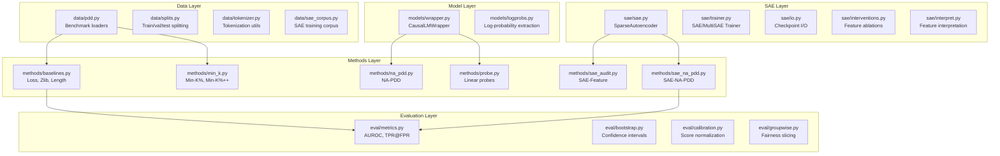

# sae_mia_audit/

Core Python package implementing the SAE-MIA evaluation framework for auditing pretraining data membership in large language models.

## Package Architecture



## Design Goals

| Goal | Implementation |
|------|----------------|
| **Reproducibility** | Every run snapshots config + git state into `runs/...` |
| **Scientific Rigor** | Calibrated splits, bootstrap CIs, low-FPR metrics |
| **Interpretability** | Feature-level attributions and causal ablation checks |
| **Modularity** | Each subpackage has a clear, single responsibility |

## Subpackages

### `data/` - Dataset Handling

Benchmark loaders for WikiMIA, MIMIR, ArxivMIA, CCNewsPDD with proper train/val/test splitting.

### `baselines/` - Group C Baselines

Neuron-level probe and random rotation control baselines for mechanistic validation experiments.

### `models/` - LLM Wrappers

HuggingFace model wrappers with activation hooking for SAE interventions.

### `sae/` - Sparse Autoencoders

SAE architecture, training, checkpointing, and mechanistic interventions.

### `methods/` - MIA Methods

All 14+ membership inference methods from baselines to SAE-NA-PDD.

### `eval/` - Evaluation Metrics

AUROC, TPR@FPR, bootstrap CIs, calibration, and groupwise fairness metrics.

### `utils/` - Infrastructure

Logging, run directories, seeding, and HuggingFace utilities.

## Entry Point

```python
from sae_mia_audit.data.pdd import load_pdd_dataset, PDDDatasetSpec
from sae_mia_audit.models.wrapper import load_model_and_tokenizer
from sae_mia_audit.methods.sae_na_pdd import SAENAPDDConfig, fit_sae_na_pdd
from sae_mia_audit.eval.metrics import compute_metrics

# Load benchmark
examples = load_pdd_dataset(PDDDatasetSpec(name="wikia", model="pythia-1b"))

# Load model
model, tokenizer = load_model_and_tokenizer("EleutherAI/pythia-1b")

# Fit SAE-NA-PDD
config = SAENAPDDConfig(sae_paths=[...], layer_indices=[4, 8])
scorer = fit_sae_na_pdd(config, model, tokenizer, train_examples)

# Evaluate
scores = scorer.score(test_examples)
metrics = compute_metrics(test_labels, scores)
print(f"AUROC: {metrics.auroc:.3f}, TPR@5%FPR: {metrics.tpr_at_fpr_5pct:.3f}")
```

## Installation

```bash
# Development install
pip install -e .

# Or add src/ to PYTHONPATH
export PYTHONPATH="${PYTHONPATH}:/path/to/sae-mia-audit/src"
```
